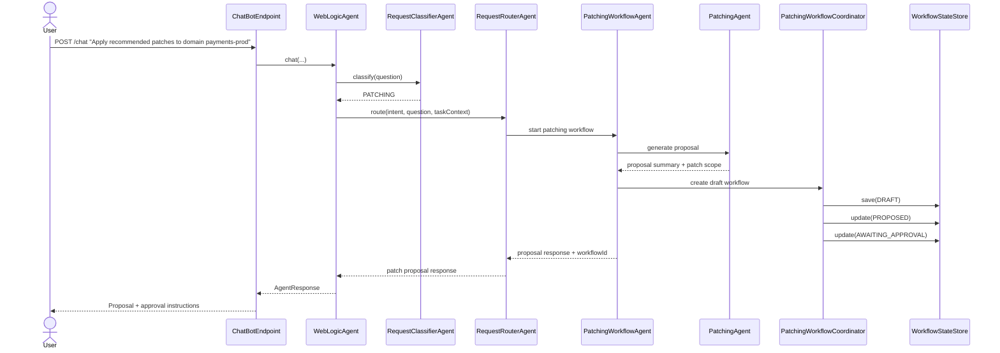
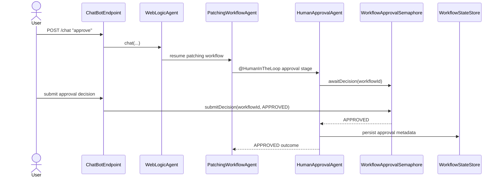
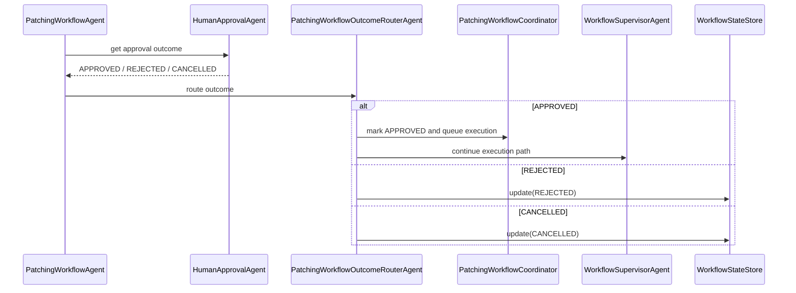
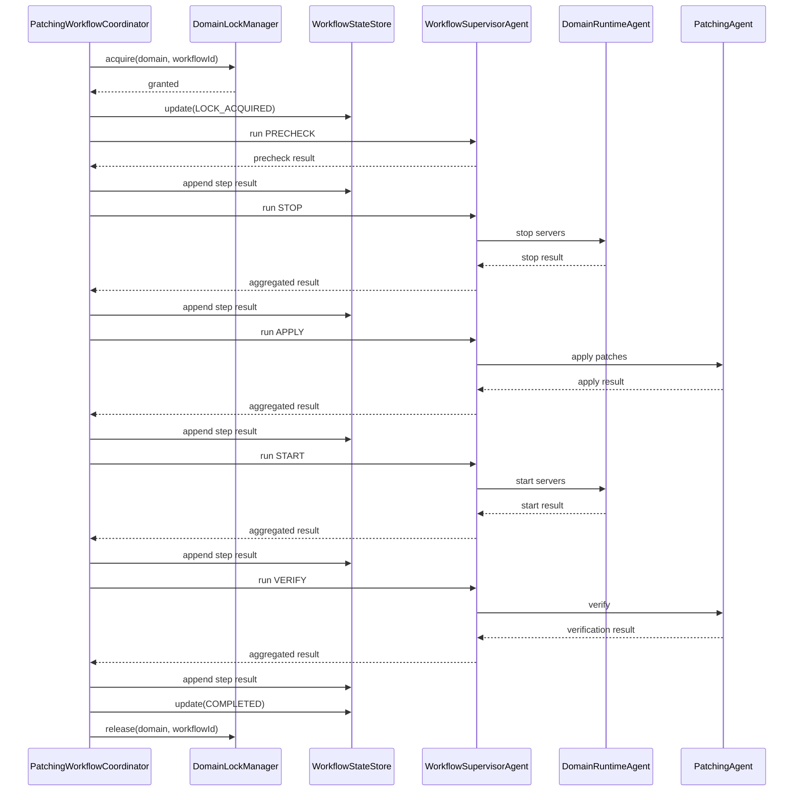
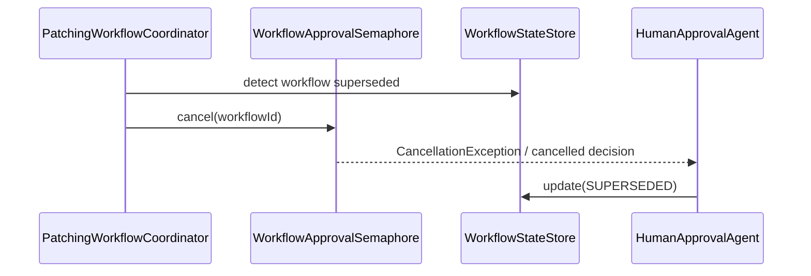
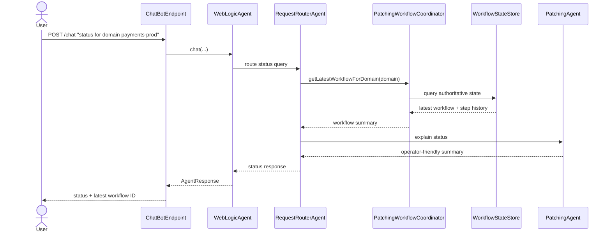

# WebLogic Patching Workflow with Human-in-the-Loop Approval - v2

## Why v2

This document is the **agentic-workflow-oriented revision** of the original patching design.

It keeps `docs/Patching-workflow.md` as the baseline reference and adds stronger workflow-oriented patterns:

- explicit declarative workflow orchestration via `@SequenceAgent`
- explicit human approval as a `@HumanInTheLoop` stage
- deterministic synchronization via `WorkflowApprovalSemaphore`
- explicit post-approval branching via `PatchingWorkflowOutcomeRouterAgent`
- structured workflow state exchange via `PatchingWorkflowStateKeys`
- cancellation and supersession semantics for pending approvals
- clearer separation between conversational agent flow and authoritative workflow state

---

## 1. Purpose and Scope

This document defines a **Human-in-the-Loop (HITL) patching workflow** for the WebLogic Agentic Assistant
using Helidon + LangChain4j declarative workflow patterns.

The workflow safely handles patching requests through:

- conversational request intake
- patch proposal generation
- explicit `@HumanInTheLoop` approval
- asynchronous workflow execution
- persisted workflow state and step history
- domain-level concurrency control
- conversational status queries and failure explanation

### In scope

- declarative patching workflow graph
- explicit HITL approval stage
- deterministic approval synchronization
- async execution with optional sync dev mode
- chat and REST API support for proposal, approval, and status/list operations
- status lookup by workflow ID or domain
- workflow listing: all workflows, pending approval, and in-execution views
- cancellation / supersession handling
- Helidon/LangChain4j-aligned sample classes and diagrams

### Out of scope

- full automatic rollback for every failure mode
- distributed workflow engine selection
- production HA lock recovery design
- full implementation code in this document

---

## 2. Key Differences from v1

Compared to `docs/Patching-workflow.md`, v2 introduces these major changes:

1. **`PatchingWorkflowAgent` becomes explicit**  
   The workflow is modeled as a declarative graph rather than only as coordinator logic.

2. **`HumanApprovalAgent` is a first-class workflow stage**  
   Approval is no longer only described conceptually; it is a concrete HITL node.

3. **`WorkflowApprovalSemaphore` provides deterministic waiting**  
   It bridges UI/chat approval to workflow resume.

4. **`PatchingWorkflowOutcomeRouterAgent` makes branching explicit**  
   Approved / rejected / cancelled / clarification-needed outcomes are modeled as explicit routing.

5. **Structured state keys are introduced**  
   State passed between workflow steps becomes explicit and inspectable.

6. **Cancellation and supersession are formalized**  
   Pending approval waits can be cancelled if a workflow is replaced or invalidated.

---

## 3. Architectural Fit with the Existing Repository

### Existing components retained

- `ChatBotEndpoint`
- `WebLogicAgent`
- `RequestClassifierAgent`
- `RequestRouterAgent`
- `PatchingAgent`
- `DomainRuntimeAgent`
- `SummarizerAgent`
- `TaskContext`

### New workflow-oriented components introduced in v2

- `PatchingWorkflowAgent`
- `HumanApprovalAgent`
- `WorkflowApprovalSemaphore`
- `PatchingWorkflowOutcomeRouterAgent`
- `WorkflowSupervisorAgent`
- `PatchingWorkflowCoordinator`
- `WorkflowStateStore`
- `DomainLockManager`
- `PatchingWorkflowStateKeys`

### Design principle

The design keeps the current repo’s multi-agent conversational front-end, but introduces a stronger
workflow layer:

- **agentic layer**: proposal, HITL interaction, explanation, routing
- **deterministic layer**: state store, locks, semaphores, validation, execution persistence

Authoritative state remains **outside** chat memory.

---

## 4. Runtime Components

### `PatchingWorkflowAgent`

Top-level declarative patching workflow.

Responsibilities:
- define the workflow graph
- invoke proposal stage
- invoke `HumanApprovalAgent`
- invoke `PatchingWorkflowOutcomeRouterAgent`
- continue execution only for approved workflows

### `HumanApprovalAgent`

Agentic HITL stage for collecting human approval.

Responsibilities:
- present proposal in approval-ready form
- ask explicitly for `APPROVE`, `REJECT`, or `CANCEL`
- pause workflow using `@HumanInTheLoop`
- return structured approval outcome

### `WorkflowApprovalSemaphore`

Deterministic synchronization bridge.

Responsibilities:
- wait for approval decision by `workflowId`
- accept approval submitted from UI/chat/API
- resume blocked HITL stage
- cancel a pending wait when workflow is reset or superseded

### `PatchingWorkflowOutcomeRouterAgent`

Declarative branch router after approval.

Responsibilities:
- approved -> execution path
- rejected -> terminal rejected path
- cancelled -> terminal cancelled path
- clarification needed -> return to approval interaction

### `WorkflowSupervisorAgent`

Execution orchestration agent.

Responsibilities:
- coordinate step-level execution
- invoke `DomainRuntimeAgent` for stop/start
- invoke `PatchingAgent` for apply/verify
- aggregate step results

### `PatchingWorkflowCoordinator`

Deterministic orchestration service.

Responsibilities:
- create and persist workflow records
- acquire and release domain locks
- submit async execution
- manage cancellation / supersession
- answer status queries from authoritative state

### `WorkflowStateStore`

Authoritative workflow state store.

Responsibilities:
- persist workflow status
- persist step history
- query by workflow ID or domain
- record approval metadata and failure reasons

### `DomainLockManager`

Domain-scoped concurrency control.

Responsibilities:
- ensure only one active patch execution per domain
- reject conflicting execution starts
- release lock on terminal completion or safe handoff

### `PatchingWorkflowStateKeys`

Constants used to exchange structured state between workflow steps.

---

## 5. Declarative Workflow Shape

The v2 workflow is intentionally modeled like the chess turn workflow: the HITL stage is an explicit part
of the declarative graph.

### Proposed shape

1. proposal generation step
2. human approval step (`@HumanInTheLoop`)
3. outcome router step
4. execution supervision step
5. final output assembly step

### Example conceptual graph

`PatchingWorkflowAgent` sub-agents:

- `PatchingAgent` (proposal mode)
- `HumanApprovalAgent`
- `PatchingWorkflowOutcomeRouterAgent`
- `WorkflowSupervisorAgent`

This allows the workflow to pause naturally at the approval boundary.

---

## 6. HITL Approval Stage

The approval stage is modeled explicitly with `@HumanInTheLoop`, not just as a boolean policy check.

### Approval lifecycle

1. proposal is generated
2. workflow enters `AWAITING_APPROVAL`
3. `HumanApprovalAgent` presents the plan
4. workflow pauses awaiting human decision
5. `WorkflowApprovalSemaphore` resumes the workflow when a decision arrives
6. `PatchingWorkflowOutcomeRouterAgent` routes the outcome

### Approval outcomes

- `APPROVED`
- `REJECTED`
- `CANCELLED`

For Phase 1 external approval handling, only `APPROVED`, `REJECTED`, and `CANCELLED` are supported.
`NEEDS_CLARIFICATION` can be introduced later as an optional conversational refinement path.

### Deterministic validation still applies

Even with `@HumanInTheLoop`, approval must still be validated against authoritative workflow state:

- workflow is still active
- workflow is still awaiting approval
- domain and patch scope still match
- decision is not stale or superseded

---

## 7. WorkflowApprovalSemaphore

Patching should use a deterministic approval waiter.

### Why it is needed

Approval is not just an LLM concern; it is also a synchronization concern.

The system needs a mechanism that:

- blocks the workflow for a specific `workflowId`
- resumes when the human decision arrives
- cancels safely if the workflow is superseded or reset

### Responsibilities

- `awaitDecision(workflowId)`
- `submitDecision(workflowId, decision)`
- `cancel(workflowId)`

### Design note

This component should be deterministic and server-side, not implemented in agent memory.

### How it is used at runtime

`WorkflowApprovalSemaphore` is the runtime bridge between a paused workflow and an external human decision.
It is a synchronization mechanism, not the authoritative record of approval state.

#### Runtime flow

1. `PatchingWorkflowCoordinator` creates the workflow and persists `AWAITING_APPROVAL`
2. `PatchingWorkflowAgent` enters `HumanApprovalAgent`
3. `HumanApprovalAgent` calls `awaitDecision(workflowId)`
4. the semaphore creates or reuses a pending future for that `workflowId`
5. the workflow remains blocked until a decision, cancellation, or timeout occurs
6. the user later responds through chat, UI, or API with `APPROVE`, `REJECT`, or `CANCEL`
7. the endpoint and coordinator validate that the workflow is still active and still awaiting approval
8. the runtime calls `submitDecision(workflowId, decision)` or `cancel(workflowId)`
9. the waiting approval stage resumes
10. the workflow persists the approval outcome and routes to the next branch

#### Responsibility split

The separation of concerns should remain explicit:

- `WorkflowApprovalSemaphore` = transient wait/resume coordination
- `WorkflowStateStore` = durable workflow and approval history
- `DomainLockManager` = post-approval execution locking

This means approval metadata such as approver, timestamp, decision, timeout, or cancellation reason must still
be persisted to `WorkflowStateStore`. The semaphore should not be treated as an audit store.

#### Why this separation matters

If the process restarts, the semaphore is expected to lose its in-memory pending waits. That is acceptable because
the authoritative workflow state remains persisted. On recovery, the system can inspect `WorkflowStateStore` and
decide whether a workflow should remain timed out, be resumed through a new interaction, or be marked cancelled.

In other words:

- `WorkflowStateStore` answers: **what is the current workflow state?**
- `WorkflowApprovalSemaphore` answers: **who is currently blocked waiting for approval, and how do we wake them up?**

---

## 8. Workflow State Model

### Authoritative workflow states

- `DRAFT`
- `PROPOSED`
- `AWAITING_APPROVAL`
- `APPROVED`
- `QUEUED`
- `LOCK_ACQUIRED`
- `PRECHECK_RUNNING`
- `STOPPING_SERVERS`
- `APPLYING_PATCHES`
- `STARTING_SERVERS`
- `VERIFYING`
- `COMPLETED`
- `FAILED`
- `REJECTED`
- `CANCELLED`
- `SUPERSEDED`
- `MANUAL_INTERVENTION_REQUIRED`

### Explicit waiting state

The key operational state for HITL is:

- `AWAITING_APPROVAL`

This state must be persisted in `WorkflowStateStore`, not inferred from prompt history.

---

## 9. Workflow State Keys

v2 introduces explicit state keys.

### Proposed keys

- `PROPOSAL_KEY`
- `APPROVAL_DECISION_KEY`
- `APPROVED_PATCH_SET_KEY`
- `TARGET_DOMAIN_KEY`
- `PATCH_EXECUTION_RESULT_KEY`
- `WORKFLOW_RESULT_KEY`
- `WORKFLOW_ACTIVE_KEY`
- `FAILURE_REASON_KEY`

### Benefits

- explicit cross-step contracts
- easier reasoning about sequence state
- less hidden coupling
- cleaner output assembly

---

## 10. Async Execution and Coordinator Responsibilities

The workflow is still designed for async execution after approval.

### Async flow

1. workflow is approved
2. coordinator persists `APPROVED`
3. coordinator acquires domain lock
4. coordinator submits execution job
5. supervisor agent orchestrates execution steps
6. results are persisted after each step

### Optional sync mode

For dev/POC mode, synchronous execution can still be supported by configuration.

---

## 11. Locking, Cancellation, and Supersession

### Locking

Domain lock is acquired only after approval and before execution begins.

### Cancellation

If a user cancels while approval is pending:

- semaphore wait is cancelled
- workflow transitions to `CANCELLED`
- no execution starts

### Supersession

If a workflow is replaced by a newer one:

- old semaphore wait is cancelled
- old workflow transitions to `SUPERSEDED`
- stale approval responses are rejected

This is a major improvement over v1.

### Same-domain request policy (Phase 1)

If a new patch request arrives for a domain that already has a non-terminal workflow,
the new request is rejected for safety.

- applies when an existing workflow is in states such as `AWAITING_APPROVAL`, `APPROVED`, `QUEUED`, or execution states
- response should remind the user that a workflow is already active and include the existing `workflowId`
- user can then approve/reject/cancel or query status of the existing workflow

---

## 12. Sequence Diagrams

These diagrams are **new in v2** and reflect the stronger HITL-oriented workflow design.

### 12.1 Proposal creation flow



### 12.2 Explicit HITL approval flow



### 12.3 Outcome routing flow



### 12.4 Async execution supervision flow



### 12.5 Cancellation / supersession flow



### 12.6 Status query flow



### 12.7 Workflow listing flows (chat and API)

The system supports list-style workflow visibility through both chat and REST APIs:

- all workflows
- pending approval workflows
- workflows in execution

The same backend query service should be used for both chat and API surfaces to avoid divergence.

---

## 13. Sample Java Interfaces and Classes

The following examples are illustrative and aligned to Helidon/LangChain4j usage patterns.

### 13.1 Workflow state keys

```java
package com.example.wls.agentic.workflow;

public final class PatchingWorkflowStateKeys {
    public static final String PROPOSAL_KEY = "proposal";
    public static final String APPROVAL_DECISION_KEY = "approvalDecision";
    public static final String APPROVED_PATCH_SET_KEY = "approvedPatchSet";
    public static final String TARGET_DOMAIN_KEY = "targetDomain";
    public static final String PATCH_EXECUTION_RESULT_KEY = "patchExecutionResult";
    public static final String WORKFLOW_RESULT_KEY = "workflowResult";
    public static final String WORKFLOW_ACTIVE_KEY = "workflowActive";
    public static final String FAILURE_REASON_KEY = "failureReason";

    private PatchingWorkflowStateKeys() {
    }
}
```

### 13.2 HumanApprovalAgent with `@HumanInTheLoop`

```java
package com.example.wls.agentic.ai;

import dev.langchain4j.agentic.Agent;
import dev.langchain4j.agentic.declarative.HumanInTheLoop;
import dev.langchain4j.service.MemoryId;
import dev.langchain4j.service.V;
import io.helidon.extensions.langchain4j.Ai;
import com.example.wls.agentic.workflow.WorkflowApprovalSemaphore;

@Ai.Agent("human-approval-agent")
public interface HumanApprovalAgent {

    @HumanInTheLoop(description = "Collect human approval for patch workflow",
                    outputKey = PatchingWorkflowStateKeys.APPROVAL_DECISION_KEY)
    @Agent(value = "Human approver for patch workflow", outputKey = "approvalDecision")
    static String await(@MemoryId String workflowId,
                        @V("approvalSemaphore") WorkflowApprovalSemaphore approvalSemaphore,
                        @V("proposalSummary") String proposalSummary) {
        return approvalSemaphore.awaitDecision(workflowId);
    }
}
```

### 13.3 WorkflowApprovalSemaphore

```java
package com.example.wls.agentic.workflow;

import java.util.concurrent.CancellationException;
import java.util.concurrent.CompletableFuture;
import java.util.concurrent.ConcurrentHashMap;
import java.util.concurrent.ConcurrentMap;

import io.helidon.service.registry.Service;

@Service.Singleton
public final class WorkflowApprovalSemaphore {
    private final ConcurrentMap<String, CompletableFuture<String>> pending = new ConcurrentHashMap<>();

    public String awaitDecision(String workflowId) {
        CompletableFuture<String> future = pending.computeIfAbsent(workflowId, id -> new CompletableFuture<>());
        try {
            return future.join();
        } finally {
            pending.remove(workflowId, future);
        }
    }

    public boolean submitDecision(String workflowId, String decision) {
        CompletableFuture<String> future = pending.computeIfAbsent(workflowId, id -> new CompletableFuture<>());
        return future.complete(decision);
    }

    public void cancel(String workflowId) {
        CompletableFuture<String> future = pending.remove(workflowId);
        if (future != null) {
            future.completeExceptionally(new CancellationException("Workflow approval cancelled"));
        }
    }
}
```

### 13.4 PatchingWorkflowOutcomeRouterAgent

```java
package com.example.wls.agentic.ai;

import io.helidon.extensions.langchain4j.Ai;
import dev.langchain4j.agentic.declarative.Output;
import dev.langchain4j.agentic.scope.AgenticScope;

@Ai.Agent("patching-workflow-outcome-router")
public interface PatchingWorkflowOutcomeRouterAgent {

    @Output
    static String route(AgenticScope scope) {
        String decision = (String) scope.readState(PatchingWorkflowStateKeys.APPROVAL_DECISION_KEY);
        return decision == null ? "CANCELLED" : decision;
    }
}
```

### 13.5 PatchingWorkflowAgent

```java
package com.example.wls.agentic.ai;

import dev.langchain4j.agentic.declarative.SequenceAgent;
import dev.langchain4j.service.MemoryId;
import dev.langchain4j.service.V;
import io.helidon.extensions.langchain4j.Ai;

@Ai.Agent("patching-workflow")
public interface PatchingWorkflowAgent {

    @SequenceAgent(outputKey = PatchingWorkflowStateKeys.WORKFLOW_RESULT_KEY,
                   subAgents = {
                       PatchingAgent.class,
                       HumanApprovalAgent.class,
                       PatchingWorkflowOutcomeRouterAgent.class,
                       WorkflowSupervisorAgent.class
                   })
    String run(@MemoryId String workflowId,
               @V("targetDomain") String targetDomain,
               @V("approvalSemaphore") WorkflowApprovalSemaphore approvalSemaphore,
               @V("proposalSummary") String proposalSummary);
}
```

---

## 14. Migration Guidance from v1

### Keep from v1

- `PatchingWorkflowCoordinator`
- `WorkflowStateStore`
- `DomainLockManager`
- `WorkflowSupervisorAgent`
- status-by-domain / status-by-ID model

### Replace or refine from v1

- approval-as-concept -> explicit `HumanApprovalAgent`
- simple approval interpretation -> `@HumanInTheLoop` + `WorkflowApprovalSemaphore`
- implicit branching -> `PatchingWorkflowOutcomeRouterAgent`
- ad hoc state sharing -> `PatchingWorkflowStateKeys`

### Migration path

1. keep existing v1 doc unchanged
2. implement v2 concepts incrementally
3. start with semaphore + explicit HITL node
4. introduce declarative workflow graph after state model is settled

---

## 15. Recommendation

The recommended v2 implementation is:

- preserve the current conversational architecture
- add explicit `PatchingWorkflowAgent`
- model approval as a real `@HumanInTheLoop` stage
- bridge human responses with `WorkflowApprovalSemaphore`
- route outcomes declaratively with `PatchingWorkflowOutcomeRouterAgent`
- keep authoritative state in `WorkflowStateStore`
- keep execution orchestration in `PatchingWorkflowCoordinator` + `WorkflowSupervisorAgent`

This makes the patching workflow much more aligned with Helidon/LangChain4j’s strongest HITL patterns.

---

## 16. Design Addendum: Workflow Identity, Locking, and Persistent History

This addendum makes several operational decisions explicit so implementation does not depend on inferred behavior.

### 16.1 Workflow identity

Each patching workflow should be created with a unique `workflowId`.

#### Recommendation

- use a UUID as the default workflow identifier
- generate it when `PatchingWorkflowCoordinator` creates the initial workflow record in `DRAFT`
- persist it immediately in `WorkflowStateStore`
- return it in the proposal response so clients can later:
  - approve or reject the proposal
  - query status
  - correlate logs, approval events, and execution results

#### Rationale

The workflow identifier represents a **workflow instance**, not a domain. A single domain can therefore have:

- one currently active workflow
- zero or more completed historical workflows
- older workflows that were rejected, cancelled, failed, or superseded

This distinction is important because domain-level concurrency control should prevent overlapping execution,
while still preserving a complete historical record of all workflow attempts.

#### Usage of `workflowId`

The same `workflowId` should be the primary correlation key for:

- `WorkflowApprovalSemaphore.awaitDecision(workflowId)`
- approval submission APIs
- status lookup by workflow ID
- step history and audit trail
- lock ownership
- supersession tracking

### 16.2 Domain locking model

`DomainLockManager` should provide domain-scoped concurrency control for patch execution.

#### Lock scope

- lock key: normalized domain identifier
- lock owner: `workflowId`
- purpose: ensure only one workflow may execute patching steps for a given domain at a time

The lock should be acquired only after approval is completed and the workflow is ready to enter execution.
It should not be held while the workflow is merely proposed or waiting for human approval.

#### Recommended semantics

- `acquire(domain, workflowId)` succeeds only if no active owner exists for that domain
- `release(domain, workflowId)` releases only when the caller owns the lock
- lock ownership mismatch should not force unlock; it should be logged as a safety event

This owner-aware release avoids one workflow accidentally releasing a lock held by another workflow.

#### Release guarantees

The coordinator should guarantee lock release by wrapping execution in `try/finally` semantics:

1. persist `APPROVED`
2. acquire domain lock
3. persist `LOCK_ACQUIRED`
4. run execution steps
5. persist terminal state such as `COMPLETED`, `FAILED`, or `MANUAL_INTERVENTION_REQUIRED`
6. release the lock in a `finally` block

This applies to both successful and failing executions.

#### Success case

- workflow reaches `COMPLETED`
- lock is released in `finally`

#### Failure case

- workflow reaches `FAILED` or `MANUAL_INTERVENTION_REQUIRED`
- failure reason is persisted
- lock is still released in `finally`

#### Cancellation case

If cancellation happens while awaiting approval, no execution lock should have been acquired yet.
If cancellation after lock acquisition is later supported, the coordinator must still ensure terminal state
persistence and owner-aware lock release.

#### POC vs production note

For this POC, an in-memory `DomainLockManager` is acceptable. For a multi-node deployment, the lock backend
should move to a shared system such as:

- Redis with lease / expiration semantics
- a relational database row with optimistic or pessimistic ownership checks
- another distributed coordination mechanism

The v2 document intentionally does not define full HA lock recovery, but the owner-based contract should be
preserved even if the backend changes.

### 16.2.1 Timeout handling and lock release

Timeout behavior should be defined explicitly and made configurable rather than left implicit in workflow code.

#### Timeout categories

For Phase 1, the workflow should distinguish between:

1. **approval timeout**
   - the workflow stays too long in `AWAITING_APPROVAL`
2. **execution timeout**
   - the workflow exceeds its allowed runtime after execution has started

#### Recommended workflow states

The implementation may either use one shared timeout terminal state or more specific timeout states.

Recommended explicit states are:

- `APPROVAL_TIMED_OUT`
- `EXECUTION_TIMED_OUT`

Step-level timeout handling may be introduced in a later phase and can map into `EXECUTION_TIMED_OUT`
or be captured as step metadata while the workflow transitions to `FAILED` or `EXECUTION_TIMED_OUT`.

#### Approval timeout behavior

If approval is not received within the configured approval timeout:

- cancel the pending semaphore wait
- transition the workflow to `APPROVAL_TIMED_OUT`
- persist timeout timestamp and reason
- reject any later stale approval response for that workflow

In this scenario, no execution lock should exist yet, so there is no domain lock to release.

#### Execution timeout behavior

If execution exceeds the configured workflow execution timeout after the domain lock has been acquired:

- transition the workflow to `EXECUTION_TIMED_OUT`
- persist the last known step and timeout reason
- attempt cooperative cancellation of the currently running work
- release the domain lock in coordinator cleanup logic

This means timeout must be handled by the same owner-aware `try/finally` cleanup path used for success and failure.

#### Step timeout behavior (future phase)

Step-specific timeout behavior (`precheck`, `stop`, `apply`, `start`, `verify`) is deferred for Phase 1.
When introduced later, step timeout outcomes should be persisted with timeout metadata, and coordinator
cleanup must still release the lock if this workflow owns it.

#### Lock release rule for timeouts

The lock release rule should be explicit:

- if the workflow times out **before** lock acquisition, no lock release is needed
- if the workflow times out **after** lock acquisition, the coordinator **must** release the lock in `finally`
- release must remain owner-aware: `release(domain, workflowId)`

This ensures that a timed-out workflow does not permanently block future patching for that domain.

#### Crash recovery note

A normal timeout is not the same as process crash or node failure.

- on normal timeout, coordinator cleanup can release the lock
- on crash, `finally` may never execute

For distributed or production deployments, this means the backing lock system should support configurable:

- lease duration
- heartbeat / renewal interval
- stale lock detection
- lock expiration or recovery policy

This is especially relevant for Redis-backed or database-backed lock implementations.

#### Recommended configurable properties

Timeouts and lock-recovery behavior should be externalized in configuration.

Examples:

- `patching.workflow.approval-timeout`
- `patching.workflow.execution-timeout`
- `patching.lock.lease-duration`
- `patching.lock.heartbeat-interval`
- `patching.lock.stale-lock-recovery-enabled`

If step timeouts are enabled in a future phase, corresponding step timeout properties can be added.

The exact property names can be refined during implementation, but the behavior should remain configuration-driven.

#### Persistence requirements for timeout events

Timeout events should be retained as part of workflow history. At minimum, persist:

- timeout type
- configured timeout value
- actual elapsed duration if known
- affected step if applicable
- cancellation outcome if cooperative stop was attempted
- lock release outcome

This is important for operator troubleshooting and for tuning timeout configuration over time.

### 16.3 Persistent workflow state is authoritative

`WorkflowStateStore` should be treated as the authoritative record of workflow lifecycle, step history,
approval metadata, and terminal outcomes.

Workflow state must not rely on chat memory or prompt reconstruction.

#### Minimum responsibilities

`WorkflowStateStore` should support:

- create workflow record
- update current workflow state
- append step history entries
- store approval decision metadata (decision, timestamp, channel)
- query by `workflowId`
- query latest workflow by domain
- query active workflow by domain
- list all workflows
- list workflows pending approval
- list workflows in execution
- mark workflows as `SUPERSEDED`, `CANCELLED`, `FAILED`, or `COMPLETED`
- store failure reason and operator-visible diagnostics

### 16.4 Persistence support and backend options

The recommended design is to define `WorkflowStateStore` as an interface with multiple implementations.

#### Baseline implementations

1. **In-memory implementation**
   - best for local development and tests
   - easiest way to validate workflow transitions and agent integration
   - not suitable for restart recovery or long-lived audit history

2. **Redis implementation**
   - good for active workflow state, coordination, and fast status lookup
   - suitable when the main need is short-to-medium-term operational state
   - can also support lock storage if desired, though lock and workflow state may still be separated logically

3. **MongoDB implementation**
   - good fit for document-style workflow records with embedded step history
   - useful when the workflow record evolves over time and needs flexible schema support
   - good candidate for historical retention and audit-style queries

4. **Relational database implementation**
   - appropriate when strong transactional guarantees, normalized audit tables, and reporting are important
   - useful for joining workflow records with operator, environment, or change-management metadata

#### Guidance on choosing a backend

- **Redis** is usually the best fit for active state, fast lookups, pending executions, and TTL-oriented retention
- **MongoDB** is usually the best fit for rich workflow documents and historical traceability
- **RDBMS** is usually the best fit for compliance-heavy environments or where workflow history must support structured reporting

For this repository, a practical path is:

- start with in-memory for implementation simplicity
- add Redis for active shared state if multi-instance coordination is needed
- add MongoDB or a relational database when durable historical records become a stronger requirement

### 16.5 Historical record retention

The workflow store should preserve historical records, not only the latest status.

That means each workflow instance should remain queryable after completion so operators can answer questions like:

- what patching workflows were attempted for domain `payments-prod` in the last 30 days?
- when was a workflow approved and through which channel (`chat` or `api`)?
- what exact step failed during a previous maintenance window?
- what workflow superseded an older pending proposal?

#### Recommended historical fields

At minimum, each persisted workflow record should include:

- `workflowId`
- `domain`
- optional conversation correlation info when available (for example `conversationId` and `taskId`)
- original request summary
- proposed patch scope or patch set summary
- current / terminal state
- timestamps:
  - created
  - updated
  - approved
  - execution started
  - completed
- approval metadata (Phase 1):
  - approval timestamp
  - decision
  - approval channel (`chat` or `api`)
- execution metadata:
  - executor node or service instance
  - lock acquisition timestamp
  - optional correlation IDs for external jobs
- failure metadata:
  - failure reason
  - failure step
  - remediation hint
- supersession metadata:
  - superseded flag
  - superseded-by workflow ID
- step history entries containing:
  - step name
  - state before / after
  - timestamp
  - summary result
  - structured details if needed

#### Retention model

Historical retention should be configurable rather than hard-coded.

Examples:

- keep all workflow records indefinitely in MongoDB or an RDBMS
- retain active and recent records in Redis with TTL
- archive older completed workflows to a long-term store

This suggests a clean separation between:

- **active operational state** used for current execution and status queries
- **historical workflow archive** used for audits, troubleshooting, and reporting

In a simple implementation, both can still live in one store. In a more mature implementation, active state and
history may be split across different storage systems.

### 16.6 Recommended storage pattern

The cleanest conceptual model is:

- `WorkflowApprovalSemaphore` = transient synchronization only
- `DomainLockManager` = concurrency guard only
- `WorkflowStateStore` = authoritative workflow record and history

If Redis is used, it is reasonable to use it for:

- active workflow records
- current status lookups
- approval correlation metadata
- optionally lock ownership

If MongoDB or another database is used, it is reasonable to use it for:

- full workflow documents
- durable step history
- terminal records retained for audit and postmortem review

An especially practical hybrid model is:

- Redis for active workflows and fast coordination
- MongoDB or RDBMS for long-lived workflow history

That said, the implementation should start with one pluggable `WorkflowStateStore` contract so backends can be
introduced incrementally without changing workflow logic.

### 16.7 Phase 1 interaction and API contracts

This section captures explicit Phase 1 decisions for implementation.

#### Interaction model

- both natural-language chat and REST APIs are supported
- both surfaces must call shared backend workflow services
- chat approvals are allowed only when workflow matching is unambiguous; otherwise require explicit `workflowId` or domain

#### Approval API

- `POST /patching/workflows/{workflowId}/approval`
- request body: `{ "decision": "APPROVE" | "REJECT" | "CANCEL" }`
- approval success response should include: `workflowId`, `domain`, current state, decision, and status guidance

#### Status and listing APIs

- `GET /patching/workflows/{workflowId}`
- `GET /patching/workflows/by-domain/{domain}/latest`
- `GET /patching/workflows/by-domain/{domain}/active`
- `GET /patching/workflows`
- `GET /patching/workflows/pending-approval`
- `GET /patching/workflows/in-execution`

#### Shared workflow summary response shape

List and summary-style status responses should use a common shape containing:

- `workflowId`
- `domain`
- `currentState`
- `createdAt`
- `updatedAt`
- optional conversation correlation info
- `requestSummary`

#### Timeouts (Phase 1)

- include approval timeout behavior
- include execution timeout behavior
- step-specific timeouts are deferred

#### Task context continuity

`TaskContext` is minimally extended with:

- `activeWorkflowId`