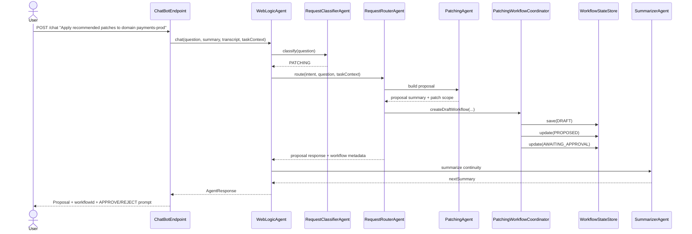
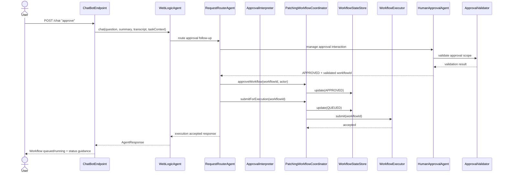
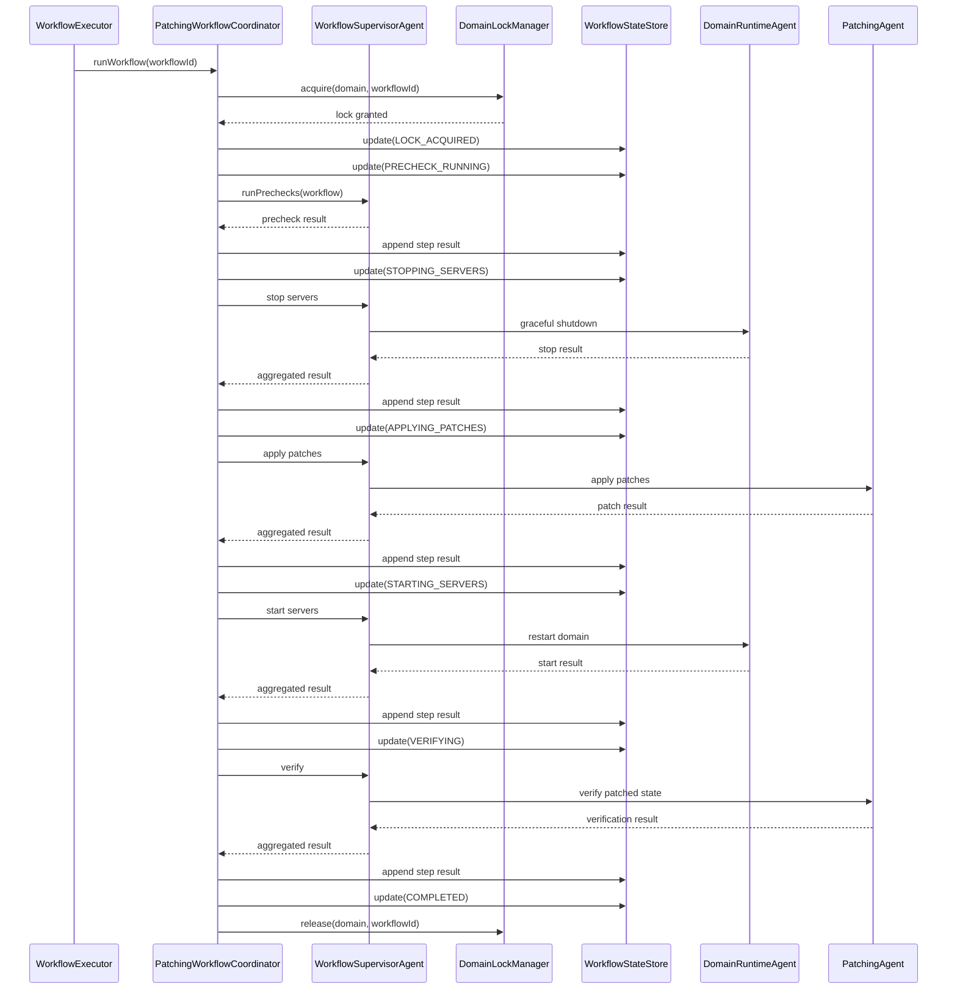
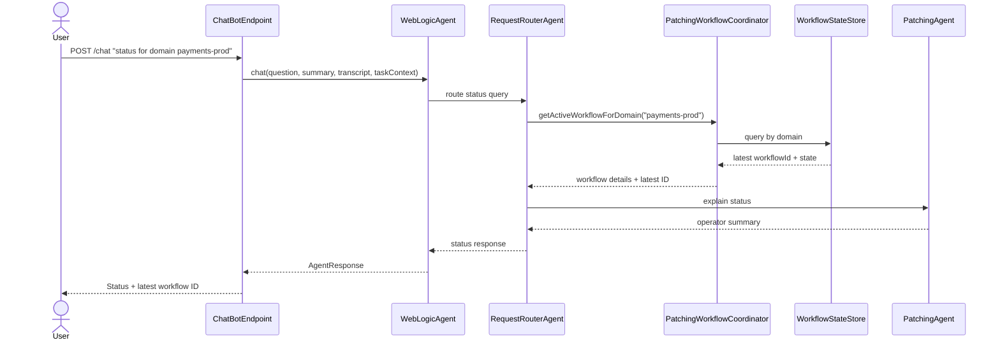

# WebLogic Patching Workflow with Human-in-the-Loop Approval

## 1. Purpose and Scope

This document defines a **Human-in-the-Loop (HITL) agentic patching workflow** for the WebLogic Agentic Assistant.

The design extends the current repository architecture so patching requests can move safely through:
- conversational request intake,
- proposal generation,
- explicit human approval,
- asynchronous workflow execution (with optional synchronous mode for dev/POC),
- persisted status tracking,
- and operator-facing completion or failure reporting.

This design is intended for the current POC stack:
- Helidon SE
- LangChain4j declarative agents
- MCP-backed operational tools
- `TaskContext` for compact conversational continuity

The workflow is designed to preserve the current multi-agent chat architecture while introducing deterministic workflow control for disruptive patch operations.

### In scope
- patch proposal generation
- explicit approval before disruptive execution
- asynchronous patch workflow execution (optional sync in dev mode)
- persisted workflow status and step history
- domain-level lock enforcement
- conversational status queries (by workflow ID or domain)
- sample Java design for implementation alignment

### Out of scope
- complete automatic rollback across all failure modes
- distributed workflow engine selection
- UI implementation details beyond chat and API response behavior
- production-grade HA lock recovery semantics

---

## 2. Design Goals

The workflow should:

1. **Require explicit approval** before stopping servers or applying patches.
2. **Use asynchronous execution** (with optional sync in dev mode) so chat requests are not blocked by long-running patch operations.
3. **Persist workflow state** so operators can query progress, failure, and completion later.
4. **Prevent concurrent patch execution** for the same domain.
5. **Integrate with the existing multi-agent architecture** instead of bypassing it.
6. **Separate agentic reasoning from deterministic execution control**.
7. **Provide clear operator-facing auditability** for approval, execution, and failure paths.

---

## 3. Architectural Fit with the Existing Codebase

## 3.1 Existing components retained

### `ChatBotEndpoint`
Remains the HTTP entrypoint for `POST /chat`.

Responsibilities in this design:
- parse request payload
- restore `summary` and `taskContext`
- invoke `WebLogicAgent.chat(...)`
- return `AgentResponse`

### `WebLogicAgent`
Remains the top-level sequence agent:
1. classifier
2. router
3. one specialist path
4. summarizer

Responsibilities in this design:
- preserve top-level orchestration
- merge structured workflow-related context into `TaskContext`
- keep workflow continuity compact through the summarizer

### `RequestClassifierAgent`
Continues to identify patch-related requests as `PATCHING`.

### `RequestRouterAgent`
Will need to distinguish patching sub-modes such as:
- proposal generation
- approval handling
- workflow status lookup
- failure explanation

### `PatchingAgent`
Remains the patching specialist, but now participates in multiple patching sub-modes:
- proposal drafting
- operator-facing execution summaries
- failure explanation
- status interpretation

During execution, `PatchingAgent` will be invoked by the `WorkflowSupervisorAgent` as part of a series of sub-agents (e.g., `DomainRuntimeAgent` for stop/start, `PatchingAgent` for apply/verify).

### `TaskContext`
Continues to carry conversation-scoped continuity and now additionally carries workflow-facing metadata needed for safe follow-up interpretation.

---

## 4. Core Design Principle: Agentic Front-End, Deterministic Back-End

The patching flow should be split into two responsibility layers.

## 4.1 Agentic layer
Use LLM agents for:
- interpreting user patching requests
- summarizing recommended patches
- producing the proposal text
- asking for approval
- explaining workflow status
- explaining failure and next steps

## 4.2 Deterministic orchestration layer
Use deterministic services for:
- workflow creation and state transitions
- lock acquisition and release
- step sequencing
- approval validation
- asynchronous execution scheduling
- retries and timeout policy
- step result persistence

This split is mandatory for operational safety. The model may explain the workflow, but it should not be the system of record for workflow state or execution decisions.

---

## 5. Proposed Runtime Components

## 5.1 New deterministic components

### `PatchingWorkflowCoordinator`
Primary orchestration service for patch workflows.

Responsibilities:
- create workflow records
- move workflows from proposal to approval to execution
- invoke asynchronous execution
- update workflow state after each step
- expose workflow status queries (by ID or domain, presenting latest ID for domain)
- guarantee terminal cleanup

### `WorkflowStateStore`
Persistence abstraction for workflow records.

Responsibilities:
- store workflow metadata
- store execution step records
- query workflows by ID/domain/task/conversation (for domain queries, return latest active workflow ID)
- persist approval metadata
- mark terminal outcomes

### `DomainLockManager`
Domain-scoped concurrency control.

Responsibilities:
- acquire lock for approved workflow execution
- reject conflicting execution attempts for the same domain
- release lock on terminal outcome

### `HumanApprovalAgent`
Explicit agentic workflow node for managing the human approval checkpoint.

Responsibilities:
- present the proposal in approval-ready language
- explain scope: domain, patch set, execution plan, risk
- ask for explicit approval/rejection
- interpret the human response at the conversation layer
- return a structured approval outcome such as:
  - `APPROVED`
  - `REJECTED`
  - `CANCELLED`
  - `NEEDS_CLARIFICATION`

### `ApprovalValidator`
Deterministic enforcement component behind the approval step.

Responsibilities:
- verify workflow is still in `AWAITING_APPROVAL`
- ensure approval applies to the correct `workflowId`
- validate target domain and patch scope match the proposal
- reject stale, ambiguous, or superseded approvals
- enforce “only one pending approval” assumptions where required

### `PatchingExecutionService`
Deterministic operational step runner.

Responsibilities:
- run prechecks
- stop servers
- apply patches
- start servers
- verify result

### `WorkflowExecutor`
Async execution mechanism.

Responsibilities:
- run approved workflows in background
- decouple long-running patch execution from request/response chat cycle
- allow status polling and later completion queries

This may initially wrap a standard Java executor service for the POC.

### `WorkflowSupervisorAgent`
New LangChain4j agent to orchestrate sub-agents during execution phases.

Responsibilities:
- Invoke series of sub-agents for each execution step, e.g.:
  - `DomainRuntimeAgent` for stop/start servers
  - `PatchingAgent` for apply patches and verify
- Coordinate tool calls via MCP for operational actions
- Handle step-level reasoning and error interpretation within the deterministic bounds

Annotated with `@Ai.SequenceAgent` to fit the existing pattern.

---

## 6. Async Execution Model (with Optional Sync in Dev Mode)

## 6.1 Why async is required
Patching is inherently long-running and may involve:
- multiple servers
- patch inventory checks
- graceful shutdown wait time
- patch application duration
- restart and verification delay

Blocking a single synchronous chat request through all steps is fragile and operationally awkward.

## 6.2 Proposed async lifecycle
1. User requests patching.
2. System returns proposal.
3. User approves.
4. System validates approval, acquires domain lock, persists `APPROVED`.
5. System submits workflow to `WorkflowExecutor`.
6. Chat response returns immediately with:
   - workflow ID
   - domain
   - accepted execution state
   - status query guidance
7. Background worker executes workflow steps asynchronously.
8. User queries workflow status later through chat.

## 6.3 POC implementation recommendation
For the POC:
- use in-process asynchronous execution via `ExecutorService`
- support optional synchronous mode in dev (e.g., via config flag) for simpler testing
- persist workflow state in memory initially
- design interfaces so Redis/Mongo/DB-backed state can be added later

---

## 7. Workflow Lifecycle and State Machine

## 7.1 Workflow states
Recommended states:
- `DRAFT`
- `PROPOSED`
- `AWAITING_APPROVAL`
- `APPROVED`
- `QUEUED`
- `LOCK_ACQUIRED`
- `PRECHECK_RUNNING`
- `STOPPING_SERVERS`
- `APPLYING_PATCHES`
- `STARTING_SERVERS`
- `VERIFYING`
- `COMPLETED`
- `FAILED`
- `REJECTED`
- `CANCELLED`
- `MANUAL_INTERVENTION_REQUIRED`

## 7.2 State transition rules

### Proposal path
- `DRAFT -> PROPOSED`
- `PROPOSED -> AWAITING_APPROVAL`

### Approval path
- `AWAITING_APPROVAL -> APPROVED`
- `AWAITING_APPROVAL -> REJECTED`
- `AWAITING_APPROVAL -> CANCELLED`

### Async scheduling path
- `APPROVED -> QUEUED`
- `QUEUED -> LOCK_ACQUIRED`

### Execution path
- `LOCK_ACQUIRED -> PRECHECK_RUNNING`
- `PRECHECK_RUNNING -> STOPPING_SERVERS`
- `STOPPING_SERVERS -> APPLYING_PATCHES`
- `APPLYING_PATCHES -> STARTING_SERVERS`
- `STARTING_SERVERS -> VERIFYING`
- `VERIFYING -> COMPLETED`

### Failure path
Any execution state may transition to:
- `FAILED`
- `MANUAL_INTERVENTION_REQUIRED`

---

## 8. Approval Semantics

Approval is a first-class control boundary.

## 8.1 Approval required before disruptive actions
The following actions require approval:
- server shutdown
- patch application
- server restart
- other disruptive workflow steps added later

## 8.2 Approval scope
Approval should bind to:
- workflow ID
- target domain
- proposed patch set
- proposal version or scope hash

## 8.3 Approval invalidation rules
Approval becomes invalid if:
- domain changes
- proposed patch set changes
- a new workflow supersedes the proposal

## 8.4 Accepted user replies
Examples that may be accepted:
- `approve`
- `approved`
- `yes, proceed`
- `proceed with workflow <id>`

If there is any ambiguity, the system should ask for clarification rather than infer approval.

---

## 9. Domain Locking Policy

## 9.1 Lock timing
Recommended rule:
- **do not lock during proposal generation**
- **acquire lock only after approval and before execution begins**

This avoids abandoned human review states blocking other domain work.

## 9.2 Lock conflict behavior
If another workflow is already active for the same domain:
- do not start a second execution workflow
- return the active workflow ID and current status
- require operator to wait, cancel, or inspect the active workflow

## 9.3 Lock release behavior
Release lock on terminal states:
- `COMPLETED`
- `FAILED`
- `REJECTED`
- `CANCELLED`
- `MANUAL_INTERVENTION_REQUIRED` after safe handoff is recorded

---

## 10. TaskContext Extensions

The current `TaskContext` already supports follow-up continuity through fields like:
- `approvalRequired`
- `pendingIntent`
- `awaitingFollowUp`
- `failureReason`

For the HITL patching workflow, extend it with the following fields.

## 10.1 Proposed additional fields
- `workflowId`
- `workflowType`
- `workflowStatus`
- `awaitingApproval`
- `approvalScopeHash`
- `proposedPatchIds`
- `approvedPatchIds`
- `executionStep`
- `domainLockHeld`
- `lastWorkflowUpdate`

## 10.2 Design guidance
- `TaskContext` should contain the concise, conversation-facing subset of workflow state.
- `WorkflowStateStore` remains the authoritative source for full workflow records.

---

## 11. Workflow Persistence Model

## 11.1 Patching workflow record
Suggested conceptual fields:
- `workflowId`
- `workflowType`
- `conversationId`
- `taskId`
- `userId`
- `targetDomain`
- `targetServers`
- `targetHosts`
- `proposedPatchIds`
- `approvedPatchIds`
- `state`
- `currentStep`
- `riskLevel`
- `approvalRequired`
- `approvalStatus`
- `approvalActor`
- `approvalTimestamp`
- `approvalScopeHash`
- `lockState`
- `lockOwner`
- `createdAt`
- `updatedAt`
- `failureReason`
- `finalSummary`

## 11.2 Step history record
Per execution step:
- `workflowId`
- `stepName`
- `state`
- `startedAt`
- `endedAt`
- `retryCount`
- `toolName`
- `toolResultSummary`
- `rawResultReference`
- `errorMessage`

---

## 12. Request Handling Paths

## 12.1 Initial patch request
Example user request:
> Apply recommended patches to domain payments-prod

System behavior:
1. classify as `PATCHING`
2. route to patching proposal path
3. gather domain + recommended patch information
4. create workflow draft
5. persist proposal as `AWAITING_APPROVAL`
6. return proposal text + workflow ID + approval instructions

## 12.2 Approval request
Example user request:
> approve

System behavior:
1. restore `TaskContext`
2. invoke `HumanApprovalAgent` to manage the approval interaction
3. `HumanApprovalAgent` interprets the conversational response
4. `ApprovalValidator` confirms the approval is valid for the current workflow
5. persist workflow as `APPROVED`
6. submit async execution job (or sync in dev mode)
7. return immediate response:
   - workflow accepted
   - workflow ID
   - status is `QUEUED` or `PRECHECK_RUNNING`

## 12.3 Rejection request
Example user request:
> reject

System behavior:
1. resolve pending proposal
2. mark `REJECTED`
3. clear approval wait markers
4. return confirmation that no execution occurred

## 12.4 Status request
Example user request:
> what is the status of workflow 2b6b...? or status for domain payments-prod?

System behavior:
1. locate workflow by ID or domain (for domain, return latest active workflow ID)
2. read latest state and step history
3. generate concise operator-friendly status summary including latest workflow ID if queried by domain

---

## 13. Deterministic Execution Steps

Execution is orchestrated by `WorkflowSupervisorAgent` invoking sub-agents in sequence.

## 13.1 Prechecks
Validate:
- domain accessibility
- patch applicability
- patch artifact availability
- operational prerequisites

## 13.2 Stop servers
Invoke `DomainRuntimeAgent` for graceful shutdown.
Persist:
- servers requested to stop
- success/failure per target

## 13.3 Apply patches
Invoke `PatchingAgent` for patch application.
Persist:
- patch results
- version/update metadata

## 13.4 Start servers
Invoke `DomainRuntimeAgent` for restart.
Persist:
- startup result per server

## 13.5 Verify
Invoke `PatchingAgent` for verification.
Validate:
- patch inventory after execution
- domain/server runtime health

## 13.6 Finalize
Persist final workflow summary and release domain lock.

---

## 14. Failure Handling

## 14.1 Recoverable failures
Examples:
- temporary connectivity loss
- retryable tool timeout
- delayed state convergence

## 14.2 Non-recoverable or operator-gated failures
Examples:
- partial patch application
- startup failure after patching
- verification mismatch
- environment uncertainty requiring human review

## 14.3 Failure states
On failure the workflow transitions to:
- `FAILED`, or
- `MANUAL_INTERVENTION_REQUIRED`

## 14.4 Required persisted failure detail
At minimum store:
- failed step
- target domain
- patch set
- error summary
- retry count
- recommended next action

---

## 15. Sequence Diagrams

## 15.1 Sequence A: Proposal generation



## 15.2 Sequence B: Approval and async execution submission



## 15.3 Sequence C: Async background execution with sub-agents



## 15.4 Sequence D: Status query by domain



---

## 16. Sample Java Interfaces and Classes (LangChain4j/Helidon Aligned)

The samples below use Helidon JSON binding (`@Json.Entity`), LangChain4j annotations (`@Ai`), and fit the existing package structure.

## 16.1 Workflow state enum

```java
package com.oracle.wls.agentic.workflow;

public enum WorkflowState {
    DRAFT,
    PROPOSED,
    AWAITING_APPROVAL,
    APPROVED,
    QUEUED,
    LOCK_ACQUIRED,
    PRECHECK_RUNNING,
    STOPPING_SERVERS,
    APPLYING_PATCHES,
    STARTING_SERVERS,
    VERIFYING,
    COMPLETED,
    FAILED,
    REJECTED,
    CANCELLED,
    MANUAL_INTERVENTION_REQUIRED
}
```

## 16.2 Workflow aggregate (Helidon JSON)

```java
package com.oracle.wls.agentic.workflow;

import io.helidon.json.binding.Json;

import java.time.Instant;
import java.util.List;

@Json.Entity
public record PatchingWorkflow(
        String workflowId,
        String conversationId,
        String taskId,
        String userId,
        String targetDomain,
        List<String> targetServers,
        List<String> targetHosts,
        List<String> proposedPatchIds,
        List<String> approvedPatchIds,
        WorkflowState state,
        String currentStep,
        String riskLevel,
        boolean approvalRequired,
        String approvalActor,
        Instant approvalTimestamp,
        String approvalScopeHash,
        Instant createdAt,
        Instant updatedAt,
        String failureReason,
        String finalSummary) {
}
```

## 16.3 Step result model (Helidon JSON)

```java
package com.oracle.wls.agentic.workflow;

import io.helidon.json.binding.Json;

import java.time.Instant;

@Json.Entity
public record WorkflowStepResult(
        String workflowId,
        String stepName,
        WorkflowState state,
        Instant startedAt,
        Instant endedAt,
        int retryCount,
        String toolName,
        String toolResultSummary,
        String rawResultReference,
        String errorMessage) {
}
```

## 16.4 Workflow state store interface

```java
package com.oracle.wls.agentic.workflow;

import java.util.List;
import java.util.Optional;

public interface WorkflowStateStore {

    PatchingWorkflow save(PatchingWorkflow workflow);

    Optional<PatchingWorkflow> findById(String workflowId);

    Optional<PatchingWorkflow> findLatestByDomain(String domain);  // Returns latest active for domain

    List<WorkflowStepResult> findStepResults(String workflowId);

    void appendStepResult(WorkflowStepResult result);
}
```

## 16.5 Domain lock manager interface

```java
package com.oracle.wls.agentic.workflow;

public interface DomainLockManager {

    boolean acquire(String domain, String workflowId);

    void release(String domain, String workflowId);

    boolean isLocked(String domain);

    String currentOwner(String domain);
}
```

## 16.6 Approval action enum

```java
package com.oracle.wls.agentic.workflow;

public enum ApprovalAction {
    APPROVE,
    REJECT,
    CANCEL,
    STATUS,
    UNKNOWN
}
```

```java
package com.oracle.wls.agentic.workflow;

import com.oracle.wls.agentic.dto.TaskContext;
import io.helidon.json.binding.Json;

@Json.Entity
public record ApprovalDecision(
        ApprovalAction action,
        String workflowId,
        boolean valid,
        String reason) {
}
```

## 16.7 HumanApprovalAgent (LangChain4j)

```java
package com.oracle.wls.agentic.ai;

import io.helidon.integrations.langchain4j.Ai;
import dev.langchain4j.service.UserMessage;
import dev.langchain4j.service.V;

@Ai.Agent("human-approval-agent")
@Ai.ChatModel("wls-shared-model")
public interface HumanApprovalAgent {

    @UserMessage("""
        Present the patching proposal to the user and manage the approval interaction.
        Explain the scope: target domain {{targetDomain}}, patches {{proposedPatchIds}}, execution plan, and risks.
        Ask for explicit approval: reply APPROVE, REJECT, or CANCEL.
        Interpret the user response and return a structured outcome.
        User request: {{question}}
        """)
    ApprovalDecision manageApproval(@V("question") String question,
                                    @V("targetDomain") String targetDomain,
                                    @V("proposedPatchIds") List<String> proposedPatchIds,
                                    @V("taskContext") TaskContext taskContext);
}
```

## 16.8 ApprovalValidator interface

```java
package com.oracle.wls.agentic.workflow;

import com.oracle.wls.agentic.dto.TaskContext;

public interface ApprovalValidator {

    boolean validate(ApprovalDecision decision, TaskContext taskContext);
}
```

## 16.7 Execution service interface

```java
package com.oracle.wls.agentic.workflow;

public interface PatchingExecutionService {

    WorkflowStepResult runPrechecks(PatchingWorkflow workflow);

    WorkflowStepResult stopServers(PatchingWorkflow workflow);

    WorkflowStepResult applyPatches(PatchingWorkflow workflow);

    WorkflowStepResult startServers(PatchingWorkflow workflow);

    WorkflowStepResult verify(PatchingWorkflow workflow);
}
```

## 16.8 Async executor interface

```java
package com.oracle.wls.agentic.workflow;

import java.util.concurrent.CompletionStage;

public interface WorkflowExecutor {

    CompletionStage<Void> submit(String workflowId, boolean syncMode);  // syncMode for dev POC
}
```

## 16.9 Workflow coordinator interface

```java
package com.oracle.wls.agentic.workflow;

import java.util.Optional;

public interface PatchingWorkflowCoordinator {

    PatchingWorkflow createDraftWorkflow(PatchingWorkflow draft);

    PatchingWorkflow markProposed(String workflowId);

    PatchingWorkflow awaitApproval(String workflowId);

    PatchingWorkflow approveWorkflow(String workflowId, String actor);

    PatchingWorkflow rejectWorkflow(String workflowId, String actor);

    void submitForExecution(String workflowId, boolean syncMode);

    Optional<PatchingWorkflow> getWorkflow(String workflowId);

    Optional<PatchingWorkflow> getLatestWorkflowForDomain(String domain);  // Latest for domain
}
```

## 16.10 Workflow supervisor agent (LangChain4j)

```java
package com.oracle.wls.agentic.ai;

import io.helidon.integrations.langchain4j.Ai;
import dev.langchain4j.agentic.SequenceAgent;
import dev.langchain4j.service.V;

@Ai.Agent("workflow-supervisor")
@Ai.ChatModel("wls-shared-model")
@Ai.McpClients("wls-tools-mcp-server")
public interface WorkflowSupervisorAgent {

    @SequenceAgent(subAgents = {DomainRuntimeAgent.class, PatchingAgent.class})
    @SystemMessage("""
        Orchestrate patching execution steps by invoking sub-agents in sequence.
        For stop/start: invoke DomainRuntimeAgent.
        For apply/verify: invoke PatchingAgent.
        Ensure each step completes before proceeding.
        Report aggregated results.
        """)
    WorkflowStepResult orchestrateStep(@V("stepName") String stepName, @V("workflow") PatchingWorkflow workflow);
}
```

## 16.11 Example in-memory lock manager (Helidon-aligned)

```java
package com.oracle.wls.agentic.workflow;

import java.util.Map;
import java.util.concurrent.ConcurrentHashMap;

public class InMemoryDomainLockManager implements DomainLockManager {

    private final Map<String, String> locks = new ConcurrentHashMap<>();

    @Override
    public synchronized boolean acquire(String domain, String workflowId) {
        return locks.putIfAbsent(domain, workflowId) == null;
    }

    @Override
    public synchronized void release(String domain, String workflowId) {
        locks.computeIfPresent(domain, (key, owner) -> owner.equals(workflowId) ? null : owner);
    }

    @Override
    public boolean isLocked(String domain) {
        return locks.containsKey(domain);
    }

    @Override
    public String currentOwner(String domain) {
        return locks.get(domain);
    }
}
```

## 16.12 Example async executor (with sync option)

```java
package com.oracle.wls.agentic.workflow;

import java.util.concurrent.CompletionStage;
import java.util.concurrent.CompletableFuture;
import java.util.concurrent.ExecutorService;

public class AsyncWorkflowExecutor implements WorkflowExecutor {

    private final ExecutorService executorService;
    private final PatchingWorkflowCoordinator coordinator;

    public AsyncWorkflowExecutor(ExecutorService executorService, PatchingWorkflowCoordinator coordinator) {
        this.executorService = executorService;
        this.coordinator = coordinator;
    }

    @Override
    public CompletionStage<Void> submit(String workflowId, boolean syncMode) {
        if (syncMode) {
            // For dev POC sync execution
            coordinator.runApprovedWorkflowSync(workflowId);
            return CompletableFuture.completedStage(null);
        } else {
            // Async
            return CompletableFuture.runAsync(() -> coordinator.runApprovedWorkflow(workflowId), executorService);
        }
    }
}
```

## 16.13 Example coordinator implementation sketch (LangChain4j integration)

```java
package com.oracle.wls.agentic.workflow;

import com.oracle.wls.agentic.ai.WorkflowSupervisorAgent;
import io.helidon.common.features.HelidonFlavor;

@HelidonFlavor("SE")
public class DefaultPatchingWorkflowCoordinator implements PatchingWorkflowCoordinator {

    private final WorkflowStateStore store;
    private final DomainLockManager lockManager;
    private final PatchingExecutionService executionService;
    private final WorkflowSupervisorAgent supervisorAgent;  // LangChain4j agent for sub-agent orchestration
    private WorkflowExecutor workflowExecutor;

    public DefaultPatchingWorkflowCoordinator(
            WorkflowStateStore store,
            DomainLockManager lockManager,
            PatchingExecutionService executionService,
            WorkflowSupervisorAgent supervisorAgent) {
        this.store = store;
        this.lockManager = lockManager;
        this.executionService = executionService;
        this.supervisorAgent = supervisorAgent;
    }

    public void setWorkflowExecutor(WorkflowExecutor workflowExecutor) {
        this.workflowExecutor = workflowExecutor;
    }

    @Override
    public void submitForExecution(String workflowId, boolean syncMode) {
        workflowExecutor.submit(workflowId, syncMode);
    }

    public void runApprovedWorkflow(String workflowId) {
        PatchingWorkflow workflow = store.findById(workflowId)
                .orElseThrow(() -> new IllegalArgumentException("Unknown workflow: " + workflowId));

        if (!lockManager.acquire(workflow.targetDomain(), workflow.workflowId())) {
            throw new IllegalStateException("Domain is already locked: " + workflow.targetDomain());
        }

        try {
            // Use supervisor agent to orchestrate sub-agents for each step
            runStepWithSupervisor("PRECHECK", workflow);
            runStepWithSupervisor("STOP_SERVERS", workflow);
            runStepWithSupervisor("APPLY_PATCHES", workflow);
            runStepWithSupervisor("START_SERVERS", workflow);
            runStepWithSupervisor("VERIFY", workflow);

            store.save(workflow.withState(WorkflowState.COMPLETED));
        } finally {
            lockManager.release(workflow.targetDomain(), workflow.workflowId());
        }
    }

    private void runStepWithSupervisor(String stepName, PatchingWorkflow workflow) {
        WorkflowStepResult result = supervisorAgent.orchestrateStep(stepName, workflow);
        store.appendStepResult(result);
        // Update workflow state based on result
    }

    // Additional methods omitted for brevity
}
```

---

## 17. Implementation Mapping to Existing Repository

## 17.1 Existing files likely impacted
- `src/main/java/com/example/wls/agentic/dto/TaskContext.java`
  - add workflow-related fields
- `src/main/java/com/example/wls/agentic/ai/RequestRouterAgent.java`
  - add workflow proposal/approval/status routing logic
- `src/main/java/com/example/wls/agentic/ai/PatchingAgent.java`
  - refine prompt to distinguish proposal, execution explanation, and status explanation modes
- `src/main/java/com/example/wls/agentic/ai/WebLogicAgent.java`
  - incorporate workflow-related structured task context updates
- `src/main/java/com/example/wls/agentic/rest/ChatBotEndpoint.java`
  - optionally enrich or preserve workflow metadata across turns

## 17.2 New package recommendation
Add a new package:
- `src/main/java/com/example/wls/agentic/workflow/`

Suggested contents:
- workflow records/enums
- coordinator
- lock manager
- approval interpreter
- execution service abstraction
- in-memory implementations for POC
- `WorkflowSupervisorAgent` interface

---

## 18. Recommended Delivery Phases

## Phase 1: POC-safe workflow skeleton
- workflow state model
- in-memory store
- in-memory lock manager
- proposal generation
- approval handling
- async execution submission (with sync dev option)
- basic status query (ID or domain)

## Phase 2: Richer execution and resilience
- step-level retry policy
- stronger failure classification
- better operator-facing failure summaries
- more explicit cancellation semantics

## Phase 3: Persistent backends and operational hardening
- persistent workflow store
- distributed lock strategy
- stronger recovery on restart
- audit export/reporting support
- proposal expiration (as future enhancement)

---

## 19. Recommendation

The recommended implementation is:
- preserve the current multi-agent chat architecture,
- introduce a **deterministic async patch workflow coordinator** (with sync dev option),
- use `TaskContext` for concise workflow continuity,
- persist authoritative workflow state separately,
- require explicit HITL approval before disruptive actions,
- orchestrate execution via `WorkflowSupervisorAgent` invoking sub-agents,
- expose workflow progress through conversational status queries (by ID or domain, showing latest ID for domain).

This design keeps the repository **agentic at the conversational layer** and **safe at the execution layer**.